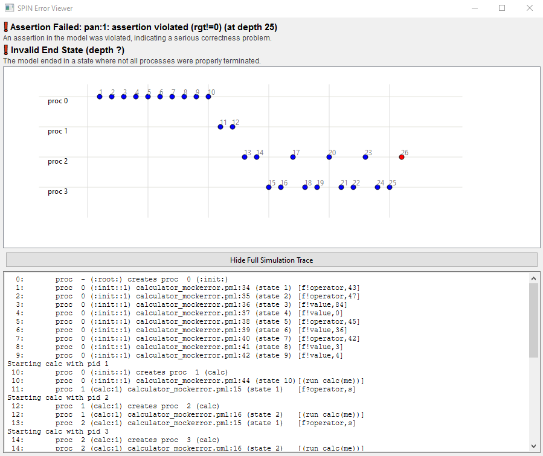

# SPIN Visualizer Tool - Advanced Data Visualization and Explanation Techniques on Design and Verification Tools

*Visualizing model checker SPIN outputs.*

## Project Overview 
SPIN Visualizer is a desktop GUI application that transforms raw SPIN output files (.out, .trail, .isf) into interactive, visual representations. It allows users to quickly identify errors such as assertions, deadlocks, unmatched communications, and never claim violations. The tool bridges the gap between the difficult to read SPIN outputs and intuitive analysis by providing execution tables linking steps to PROMELA code, chronological timelines of process execution, interactive 3D state space graphs and easy to understand explanations of why a simulation failed. This project was built with [**Python**](https://www.python.org/), [**PyQt6**](https://pypi.org/project/PyQt6/) for the graphical user interface, [**Matplotlib**](https://matplotlib.org/) for timeline visualization, [**Plotly**](https://plotly.com/) for 3D state space visualization, [**NetworkX**](https://networkx.org/) for graph representations. 

## Features

### **Users can**

 - Load SPIN output files and parse them into JSON
 - View execution steps in a table with code line references
 - Explore chronological timelines of processes
 - Visualize the 3D state space of the simulation
 - Understand errors and why they occurred
 - Get a quick overview of verification results

### **Details**:

#### **User Dashboard & File Parsing**:

  - Centralized dashboard for file selection, clearing data, and running modules.  
  - Allows creation, deletion and loading of "model profiles" containing sets of SPIN files for quick analysis.
  - Supports `.out`, `.trail`, `.pml`, and `.isf` files. 
  - Extracts execution steps, process IDs, model line numbers, actions, and critical information such as assertions, deadlocks, invalid end states, execution depth, and memory usage. 
  - Converts all parsed data into `parsed_data.json`, creating a flexible bridge between the parser and visualization modules.

#### **Visualizer Module**
  

  - Presents execution in a detailed table with step number, process, code line, action performed, and the corresponding PML code.  
  - Users can search, filter, and export data to Excel (`.xlsx`) or HTML.  
  - Highlights errors detected during SPIN analysis, providing quick access to assertion violations, deadlocks, and unmatched communications.

#### **Timeline Module**:

  - Displays a chronological execution timeline with each process as a separate row.  
  - Marks steps in order, making it easier to detect bottlenecks and interactions between processes.

#### **3D State Graph Module**:

  - Generates a 3D visualization of the execution state space using NetworkX and Plotly.  
  - Nodes represent execution steps, edges represent transitions, allowing interactive exploration of the system behavior.

#### **Why It Failed Module**:
  

  - Provides a clear timeline of transitions with explanatory messages for assertions, deadlocks, unmatched communications, or never claim violations.  
  - Displays the full simulation trace for in-depth investigation of each step.

#### **Overview Module**:
  

  - Summarizes SPIN verification results, including compilation commands, verification settings, state space information, and resource usage.  
  - Offers customizable views and clear visual charts for quick understanding of verification outcomes.

## Instructions

### Requirements:
1. Python 3.10+ installed on your system.
2. Python packages (install via pip):
    - pyqt6
    - matplotlib
    - plotly
    - networkx
    - openpyxl

### Installation:
1. Clone the repository

### How to Run:
1. Navigate to the project directory in your system in cmd
2. Run the application:
    - python dashboard.py
3. Use the Dashboard to load SPIN files. Two example system models with all relevant files can be found in [examples](spin_tool/examples/) folder
4. Run the Parser
5. Select Analysis Modules
6. Optionally, create or delete model profiles for easier and faster analysis
7. Preferably clear all files with 'Clear Files' button before exiting

## License
Distributed under the MIT License. See the LICENSE file for more information.

